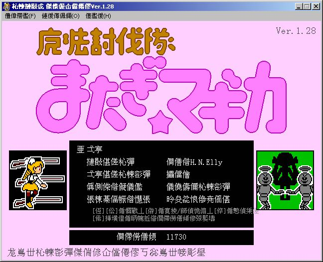

# ⑩的游戏修改小课堂4——HOOK、DLL注入与游戏乱码修正
这篇文章的初衷是给像我一样的初学者讲解一下hook技术与DLL注入技术，由于我的水平不高，所以文章的内容也只是入门级别的……需要注意的是，我在写代码的时候用了一些C++11标准的东西，所以可能需要新一点的编译器（我用的IDE是visual studio community 2019）

## 背景
这几天发现了一个《魔法少女小圆》的同人小游戏《魔法討伐隊 またぎ☆マギカ》（游戏作者的网站：http://d.hatena.ne.jp/he-noki ），看起来很有趣。不过因为这个游戏是日本的爱好者制作的，作者直接用的shift-jis编码，所以游戏打开后全是乱码……



我搜索了一下，发现有NTLEA（ https://github.com/zxyacb/ntlea ）之类的小工具可以解决乱码的问题。于是乎我顺利地解决了游戏乱码的问题，开心地玩起了游戏，这篇文章到这里就结束了，大家是否学会了呢~

好吧，上面是开玩笑的……对NTLEA的原理感到好奇的我看了一下它的源码，发现是通过hook实现的。一直以来我都想学习hook和DLL注入的技术，但是因为太懒而没有行动。正好通过这个机会学习了一下，并自己写了一个小程序来解决《魔法討伐隊 またぎ☆マギカ》的乱码问题。由于技术所限（我没有接触过windows内核编程，对WIN32 API内部的实现一无所知）我只解决了GDI绘图乱码的问题，菜单和窗口我就不管了……


废话就不多说了，那么就让我们开始吧。

# HOOK

## HOOK简介
在讲hook之前呢，我需要先说明一下什么是hook技术，以及为什么hook技术可以解决游戏的乱码。

通俗来讲，**hook技术就是让目标函数在执行之前先执行一段我们自己写的代码**。就拿我们熟悉的`MessageBox`函数来说，通过hook技术，我们可以在自己的代码里把传入的参数通通改掉，从而让弹出的窗口显示自己的内容；也可以什么都不做直接return，让`MessageBox`失效而弹不出窗口。

那么，为什么hook技术可以解决游戏的乱码问题呢？GDI绘制字符串的时候，会先调用`GdiGetCodePage`获取当前代码页，再用`MultiByteToWideChar`将字符串转换为UNICODE并输出。日本网友在制作游戏的时候用的是shift-jis编码，`GdiGetCodePage`获取的代码页为932，可以正确转换并输出。而我们的电脑上用的是简体中文GB2312，其代码页是936，那么GDI绘制的时候就会错误地按照GB2312编码将程序中的日文字符串转换为UNICODE，造成乱码的问题。因此，我们可以利用hook技术，让`GdiGetCodePage`返回932而不是936，这样程序就会正确地按照shift-jis来解码了。

## HOOK实现

那么，我们要如何实现hook呢，很简单，我们只要把目标函数开头的机器码改成jmp指令，jmp到我们自己的函数里就行了。

第一步，获取目标函数地址。

为了修改目标函数，我们自然要先获取目标函数的地址。这里自然就是用大家都很熟悉的LoadLibraryA和GetProcAddress函数。通过LoadLibraryA加载指定DLL，再通过GetProcAddress函数获取指定DLL中指定函数的地址，相信大家很容易就可以写出来。

```cpp
FARPROC getLibraryProcAddress(LPCSTR libName, LPCSTR procName)
{
	auto dllModule = LoadLibraryA(libName);
	if (dllModule == NULL) {
		throw std::runtime_error("Unable to load library!");
	}
	auto procAddress = GetProcAddress(dllModule, procName);
	if (procAddress == NULL) {
		throw std::runtime_error("Unable to get proc address!");
	}
	return procAddress;
}
```

需要注意的是，获取出的内存地址是代码段，一般来说是不可读写的。我们在修改之前需要先用VirtualProtect函数修改其保护属性为可读可写可执行。这一点后面的代码会体现。

第二步，生成jmp指令的机器码，写入目标函数的开头

前文说了，我们要在目标函数的开头写入jmp指令，那么自然就要先生成jmp指令的机器码。一般的jmp指令用的是相对偏移，还需要用目标地址与下一条指令的地址相减才能得到。jmp指令自己占5个字节，所以下一条指令的地址是**当前地址 + 5**，那么jmp指令的相对偏移的计算公式为 **目的地址 - 当前地址 - 5**

为了方便，其实我们也可以将目标地址写入eax寄存器中，再使用jmp eax指令，这样可以省掉计算，但是会覆盖掉eax函数中原有的值，不是太安全。下面上代码~

先是一个转换类，可以按照byte数组的方式来读取一个目标地址中的4个字节。这一点其实用`union{LPVOID address; BYTE bytes[4];};`也可以办到，但是C++里面给union的一个成员赋值，再用另一个成员的方式访问其实是未定义行为，所以我干脆写了一个转换类……
```cpp
//用于将地址转换为byte数组的类，其实用union也可以办到，
//不过是C++的未定义行为，所以这里写了一个转换类
class Address
{
private:
	enum { SIZE = 4 };
	BYTE bytes[SIZE];
public:
	const BYTE operator[](int i) const
	{
		return bytes[i];
	}
	Address(LPVOID address)
	{
		memcpy(bytes, &address, SIZE);
	}
	Address(DWORD address)
	{
		memcpy(bytes, &address, SIZE);
	}
};
```
下面就是管理HOOK的类了。我们在构造函数中，先按照刚才所说的方式来计算jmp指令的相对偏移，将生成的机器码保存在成员数组`shellCode`中，然后再将目标函数原有的前5个字节也保存在成员数组`originalBytes`中（不然你hook了之后就无法复原了……），当然，要先通过`VirtualProtect`函数来设置目标函数前5个字节的保护属性为可读写可执行。
```cpp
class HookManager
{
	enum { SHELLCODE_SIZE = 5 };
private:
	LPVOID targetFuncAddr;
	LPVOID hookFuncAddr;
	BYTE originalBytes[SHELLCODE_SIZE];
	BYTE shellCode[SHELLCODE_SIZE];
	DWORD oldProtect = 0;
public:
	// 参数是目标函数地址targetFuncAddress，我们自己的hook函数的地址HookFuncAddress
	explicit HookManager(PVOID targetFuncAddress, PVOID hookFuncAddress)
		:targetFuncAddr(targetFuncAddress), hookFuncAddr(hookFuncAddress)
	{
		// 计算相对偏移生成shellcode
		Address offset((DWORD)hookFuncAddress - ((DWORD)targetFuncAddress + 5));
		BYTE tempShellCode[SHELLCODE_SIZE] = {
			0xE9, offset[0], offset[1], offset[2], offset[3],
		};
		memcpy(shellCode, tempShellCode, SHELLCODE_SIZE);

		//保存原有的字节，需要先把目标函数的虚拟内存设置为可读写
		VirtualProtect(targetFuncAddr, SHELLCODE_SIZE, PAGE_EXECUTE_READWRITE, &oldProtect);
		memcpy(originalBytes, targetFuncAddr, SHELLCODE_SIZE);
	}
	void hook()
	{
		//将shellcode写入目标函数来hook
		memcpy(targetFuncAddr, shellCode, SHELLCODE_SIZE);
	}
	void unhook()
	{
		//恢复原先的字节来unhook
		memcpy(targetFuncAddr, originalBytes, SHELLCODE_SIZE);
	}
	~HookManager()
	{
		//析构时将目标函数的虚拟内存的保护属性恢复
		VirtualProtect(targetFuncAddr, SHELLCODE_SIZE, oldProtect, &oldProtect);
	}
};
```

这样，我们之后就可以用目标函数地址和我们的hook函数地址声明一个`HookManager`对象，再调用这个对象的hook方法，下面就让我们使用刚刚的`HookManager`类来编写`main`函数吧~

## HOOK效果
那么，我们就拿大家最熟悉的`MessageBox`函数来试验吧~
我们先声明自己的Hook函数，并用其声明一个全局的`HookManager`对象
```cpp
extern "C" {
	int WINAPI MessageBoxWHookFunc(HWND hWnd, LPCWSTR lpText, LPCWSTR lpCaption, UINT uType);
}
static HookManager MessageBoxWHookManager{
	getLibraryProcAddress("user32.dll", "MessageBoxW"),
	MessageBoxWHookFunc
};
int WINAPI MessageBoxWHookFunc(HWND hWnd, LPCWSTR lpText, LPCWSTR lpCaption, UINT uType)
{
	puts("Hook MessageBoxW");
	MessageBoxWHookManager.unhook();
	int ret = MessageBoxW(hWnd, L"MessageBoxW已HOOK", lpCaption, uType);
	MessageBoxWHookManager.hook();
	return ret;
}
```
注意**我们的hook函数`MessageBoxWHookFunc`需要与被hook的`MessageBoxW`函数有一样的签名**，因为外面调用的时候还是按照`MessageBoxW`一样的方式用堆栈传参，我们要确保栈平衡。

在我们的函数里，先是在控制台输出了一条信息，之后再将目标函数`MessageBoxW`前面的字节恢复（不然调用`MessageBoxW`就会再次跳转到我们的hook函数里来了……），然后调用目标函数`MessageBoxW`，最后再将目标函数前面的字节改回hook的jmp指令。这样，我们就可以在main函数里试一试效果了。
```cpp
int main(void)
{
	MessageBoxW(
		NULL,
		(LPCWSTR)L"你好\n世界\n",
		(LPCWSTR)L"测试",
		MB_ICONWARNING | MB_CANCELTRYCONTINUE | MB_DEFBUTTON2
	);
	MessageBoxWHookManager.hook();
	MessageBoxW(
		NULL,
		(LPCWSTR)L"你好\n世界\n",
		(LPCWSTR)L"测试",
		MB_ICONWARNING | MB_CANCELTRYCONTINUE | MB_DEFBUTTON2
	);
	MessageBoxWHookManager.unhook();
	return 0;
}
```
运行效果如下，程序先是弹出了正常的消息框，而hook之后，控制台输出了Hook MessageBoxW的消息，弹出的消息框的内容也被改掉了。


这个时候，大家大概已经发现了一个很严重的问题：**这仅仅是hook了自己写的程序而已，而我们的目标是hook游戏啊**！我们又没办法往游戏的main函数里加上hook代码……怎么让游戏的进程执行我们的代码呢？这就是我们需要讲解的第二部分知识，**DLL注入**了。

# DLL注入

## DLL注入简介
向刚才一样，我们先来简要介绍一下DLL注入。我们知道，在通过`LoadLibrary`函数加载DLL之时，DLL里的`DllMain`函数会被调用。DLL注入就是利用这个原理，让目标进程执行`LoadLibrary`函数加载我们自己编写的DLL，在`DLLMain`里写入自己的代码，从而让目标进程执行我们的代码。需要注意的是，DLL注入多种多样，是一种常见于木马病毒的技术，我用的方式古老而基础，所以程序一编译出来就被杀毒软件祭天了……所以我还是需要退出杀软才能运行我的程序……

## DLL注入实现——准备
实现DLL注入的第一步自然是先弄一个DLL出来……用VS创建一个DLL工程，引用我们刚才的hook代码。还记得吗？我们的目标是hook `GdiGetCodePage`函数，使其返回932而不是936。这里只要依照上面实现hook MessageBox的程序写一下就好了。

```cpp
extern "C"
{
    //使用MessageBoxTimeoutA可以让提示框在指定时间自动关闭，但是这是一个未公开的API，
    //所以需要用extern "C"声明一下
    int WINAPI MessageBoxTimeoutA(
        IN HWND hWnd, 
        IN LPCSTR lpText, 
        IN LPCSTR lpCaption, 
        IN UINT uType, 
        IN WORD wLanguageId, 
        IN DWORD dwMilliseconds
    );
};

DWORD WINAPI GdiGetCodePageHookFunc(DWORD param)
{
    return (DWORD)932;
}

static HookManager GdiGetCodePageHookManager{
    getLibraryProcAddress("gdi32.dll", "GdiGetCodePage"),
    GdiGetCodePageHookFunc
};

BOOL APIENTRY DllMain( HMODULE hModule,
                       DWORD  ul_reason_for_call,
                       LPVOID lpReserved
                     )
{
    switch (ul_reason_for_call)
    {
    case DLL_PROCESS_ATTACH:
        MessageBoxTimeoutA(NULL, "DLL inject success!", "Great!", MB_OK, 0, 1000);
        GdiGetCodePageHookManager.hook();
    case DLL_THREAD_ATTACH:
    case DLL_THREAD_DETACH:
    case DLL_PROCESS_DETACH:
        break;
    }
    return TRUE;
}
```
之后的事情就比较麻烦了：我们要让目标进程执行`LoadLibrary`。而且我们的需求和通常的注入有所不同：我们要在游戏进程启动时就进行注入，否则等到游戏进程启动完毕，乱码的界面就已经绘制出来了……
这一步的方法多种多样，我会讲解两种方法，一个是通过远程线程注入，这也是最经典的注入方法；另一种是通过shellcode注入，让目标进程先执行一段我们的shellcode来调用`LoadLibrary`。

那么，接下来就是第二步了：创建挂起的游戏进程。前面说了，我们要在游戏进程启动之时就进行，所以，我们直接用`CreateProcessA`来创建游戏进程，在创建时将进程的启动标志设为`CREATE_SUSPENDED`，这样，游戏进程一经创建就会暂停。待我们成功注入之后，再继续运行程序。和刚才一样，我写了一个类来管理进程的创建……
```cpp
//管理子进程的类
class ChildProcess
{
private:
	STARTUPINFOA si;
	PROCESS_INFORMATION pi;
public:
	explicit ChildProcess(LPCSTR applicationPath, DWORD creationFlags)
	{
		ZeroMemory(&si, sizeof(si));
		si.cb = sizeof(si);
		ZeroMemory(&pi, sizeof(pi));
		if (!CreateProcessA(applicationPath,
			NULL, NULL, NULL, FALSE, creationFlags, NULL, NULL,
			&si, &pi))
		{
			throw std::runtime_error("Failed to create child process!");
		}
	}
	PROCESS_INFORMATION& getProcessInformation()
	{
		return pi;
	}
	~ChildProcess()
	{
		WaitForSingleObject(pi.hProcess, INFINITE);
		CloseHandle(pi.hProcess);
		CloseHandle(pi.hThread);
	}
};
```

然后在main函数里加入`ChildProcess process("C:\\GAMES\\madomagi\\madomagi 1.28\\Player.exe", CREATE_SUSPENDED);`
这样，我们的程序就可以以挂起的方式创建游戏进程了

第三步是提权，因为不是重点，所以这里我直接用了看雪论坛上IamHuskar的代码，详细可以参考MSDN上微软对AdjustTokenPrivileges等相关函数的讲解
```cpp
BOOL EnableDebugPriv()
{
	HANDLE   hToken;
	LUID   sedebugnameValue;
	TOKEN_PRIVILEGES   tkp;
	if (!OpenProcessToken(GetCurrentProcess(), TOKEN_ADJUST_PRIVILEGES | TOKEN_QUERY, &hToken))
	{
		return   FALSE;
	}

	if (!LookupPrivilegeValue(NULL, SE_DEBUG_NAME, &sedebugnameValue))
	{
		CloseHandle(hToken);
		return   FALSE;
	}
	tkp.PrivilegeCount = 1;
	tkp.Privileges[0].Luid = sedebugnameValue;
	tkp.Privileges[0].Attributes = SE_PRIVILEGE_ENABLED;

	if (!AdjustTokenPrivileges(hToken, FALSE, &tkp, sizeof(tkp), NULL, NULL))
	{
		return   FALSE;
	}
	CloseHandle(hToken);
	return TRUE;
}
```

第四步就是重头戏——将代码注入进程了。

## DLL注入实现——远程线程注入
我们先介绍远程线程注入的方法。这个方法原理很简单，WIN32有个API`CreateRemoteThread`，可以在别的进程中创建一个进程，以指定参数执行指定的函数。那么，我们的方法就显而易见了：创建远程线程，执行`LoadLibrary`函数，参数是我们的DLL的路径。

不过，我们需要先在目标进程中用`VirtualAllocEx`先申请一块内存空间，用于存放我们的DLL的路径。大家大概已经猜到了，没错，我写了一个类来管理虚拟内存……构造函数的参数是进程句柄，内存大小和内存的保护标志。我还实现了一个方法`copyFromBuffer`，可以将传入的数组的内容拷贝到申请到的虚拟内存中，为我们后续代码提供便利。
```cpp
//管理虚拟内存的类
class VirtualMemory
{
private:
	LPVOID address;
public:
	const HANDLE process;
	const SIZE_T size;
	const DWORD protectFlag;
	explicit VirtualMemory(HANDLE hProcess, SIZE_T dwSize, DWORD flProtect) :
		process(hProcess), size(dwSize), protectFlag(flProtect)
	{
		address = VirtualAllocEx(process, NULL, size, MEM_COMMIT, protectFlag);
		if (address == NULL)
			throw std::runtime_error("Failed to allocate virtual memory!");
	}
	~VirtualMemory()
	{
		if (address != NULL)
			VirtualFreeEx(process, address, 0, MEM_RELEASE);
	}
	//将buffer中的内容拷贝到虚拟内存
	BOOL copyFromBuffer(LPCVOID buffer, SIZE_T size)
	{
		if (size > this->size)
			return FALSE;
		return WriteProcessMemory(process, address, buffer, size, NULL);
	}
	LPVOID getAddress()
	{
		return address;
	}
};
```

之后就没什么好说的了，用刚才实现的`getLibraryProcAddress`函数来获取`LoadLibraryA`地址，用`VirtualMemory`类申请一块内存空间，用`CreateRemoteThread`函数创建一个远程线程，并用`ResumeThread`使远程线程继续运行，最后再让进程的主线程继续运行就行了……
```cpp
inline FARPROC getLoadLibraryAddress()
{
	return getLibraryProcAddress("kernel32.dll", "LoadLibraryA");
}

void injectWithRemoteThread(PROCESS_INFORMATION& pi, const char *dllPath)
{
	//申请dll路径的内存，获取LoadLibraryA地址
	puts("Allocating Remote Memory For dll path");
	const int bufferSize = strlen(dllPath) + 1;
	VirtualMemory dllPathMemory(pi.hProcess, bufferSize, PAGE_READWRITE);
	dllPathMemory.copyFromBuffer(dllPath, bufferSize);
	PTHREAD_START_ROUTINE startRoutine = (PTHREAD_START_ROUTINE)getLoadLibraryAddress();

	//用dll路径和LoadLibraryA的地址创建远程线程
	puts("Creatint remote thread");
	HANDLE remoteThreadHandle = CreateRemoteThread(
		pi.hProcess, NULL, NULL, startRoutine, dllPathMemory.getAddress(), CREATE_SUSPENDED, NULL);
	if (remoteThreadHandle == NULL) {
		throw std::runtime_error("Failed to create remote thread!");
	}

	//继续远程线程以执行LoadLibraryA，等待其执行完毕
	puts("Resume remote thread");
	ResumeThread(remoteThreadHandle);
	WaitForSingleObject(remoteThreadHandle, INFINITE);
	CloseHandle(remoteThreadHandle);

	//继续主线程
	puts("Resume main thread");
	ResumeThread(pi.hThread);
}
```

在main函数里用`injectWithRemoteThread(process.getProcessInformation(), "hook_dll.dll");`调用我们上面写的函数就行了。（还记得吗，`process`是我们上面管理进程的类的对象）。
这里顺便说一下，远程线程注入是一种通用的注入方式，不要求目标进程处于暂停的状态，大家完全可以用`FindWindowEx`、`GetWindowThreadProcessId`和`OpenProcess`配合拿到指定窗口的进程句柄，然后用`CreateRemoteThread`在它上面创建远程线程注入。我们这里是因为要在游戏开始之前注入，所以让游戏进程暂停。

## DLL注入实现——shellcode注入
除了远程线程之外，还有另一种注入方式。因为游戏进程都是由我们的代码创建的，所以我们对其有很大的控制权。我们完全可以在其内存空间中写入一段shellcode机器码来加载DLL，把进程的EIP寄存器直接修改到我们的机器码，这样游戏进程一继续，就会直接执行我们的机器码了。在我们的机器码末尾，再想办法跳回进程原先的EIP寄存器指向的地址，也就是游戏进程的起始点。这个方法相比远程线程要麻烦一些。

大家可能已经猜到了，我写了一个类来生成shellcode……我的机器码一开始先push eip，而末尾是ret指令，这样就可以顺利地回到游戏进程的起始点了。push eip之后，我用pushfd和pushad保存当前所有的寄存器。之后，我把DLL路径的地址压入堆栈，将`LoadLibraryA`的地址放入eax中，然后call eax，这样就可以顺利调用`LoadLibraryA`加载我们的DLL了。由于`LoadLibraryA`的调用方式约定是stdcall（被调用者清理堆栈），所以调用之后栈中的DLL路径就被清理了。最后，我们用popad和popfd恢复所有的寄存器的值，ret回游戏进程起点。
```cpp
class ShellCode
{
public:
	enum { SIZE = 22 };
private:
	std::array<BYTE, SIZE> shellCode;
public:
	explicit ShellCode(const Address& eip, const Address& dllPath)
	{
		const Address proc(getLoadLibraryAddress());
		shellCode = {
			// Push eip
			0x68, eip[0], eip[1], eip[2], eip[3],
			// Push all flags
			0x9C,
			// Push all register
			0x60,
			// Push &string
			0x68, dllPath[0], dllPath[1], dllPath[2], dllPath[3],
			// Mov eax, &LoadLibrary
			0xB8, proc[0], proc[1], proc[2], proc[3],
			// Call eax
			0xFF, 0xD0,
			// Pop all register
			0x61,
			// Pop all flags
			0x9D,
			// Ret
			0xC3
		};
	}
	const BYTE* data() const
	{
		return shellCode.data();
	}
};
```
有了上面的shellcode类，我们的注入函数的思路也就明确了。跟刚才一样，先申请DLL路径的内存，用游戏进程的EIP和DLL路径的地址生成shellcode。之后申请存放shellcode的虚拟内存，将shellcode拷贝到虚拟内存当中。最后，将游戏进程的EIP改为我们的shellcode虚拟内存的地址，继续主线程就行啦~
```cpp
void injectWithShellCode(PROCESS_INFORMATION& pi, const char* dllPath)
{
	//获取进程主线程eip
	puts("Get EIP");
	CONTEXT ctx;
	ctx.ContextFlags = CONTEXT_FULL;
	GetThreadContext(pi.hThread, &ctx);

	//申请dll路径的内存，生成shellcode
	puts("Allocating Remote Memory For dll path");
	int bufferSize = strlen(dllPath) + 1;
	VirtualMemory dllPathMemory(pi.hProcess, bufferSize, PAGE_READWRITE);
	dllPathMemory.copyFromBuffer(dllPath, bufferSize);
	ShellCode shellCode(ctx.Eip, dllPathMemory.getAddress());

	//申请shellcode的内存，将shellcode写入空间中
	puts("Allocating Remote Memory For Shellcode");
	VirtualMemory shellCodeMemory(pi.hProcess, ShellCode::SIZE, PAGE_EXECUTE_READWRITE);
	shellCodeMemory.copyFromBuffer(shellCode.data(), ShellCode::SIZE);

	//设置进程主线程eip为刚刚申请到的shellcode的内存地址
	puts("Set EIP");
	ctx.Eip = (DWORD)shellCodeMemory.getAddress();
	SetThreadContext(pi.hThread, &ctx);

	//继续主线程以执行shellcode
	puts("Resume main thread");
	ResumeThread(pi.hThread);

	//sleep一下让shellcode执行完毕，不然没执行完就free就惨了
	//因为我们的DLL中的提示框是1秒后自动关闭，所以这里就等2秒
	Sleep(2000);
}
```

我们的main函数如下，可以选择注入的方式：
```cpp
int main(int argc, char* argv[])
{
	if (!EnableDebugPriv()) {
		puts("Failed to enable debug privileges");
		return -1;
	}
	puts("Choose inject method:");
	puts("1. remote thread 2. shellcode");
	puts("please enter your choice:");
	char choice = getchar();

	//创建挂起线程
	ChildProcess process("C:\\GAMES\\madomagi\\madomagi 1.28\\Player.exe", CREATE_SUSPENDED);

	if (choice == '1') {
		//注入远程线程
		injectWithRemoteThread(process.getProcessInformation(), "hook_dll.dll");
	} else {
		//注入shellcode
		injectWithShellCode(process.getProcessInformation(), "hook_dll.dll");
	}
	
	return 0;
}
```

## DLL注入效果
终于，我们可以远行我们的程序来看DLL注入的效果了。运行的截图如下：
程序运行之后，先是弹出一个消息框，提示我们注入成功，因为我们在DLL中用的是`MessageBoxTimeoutA`函数，所以1秒之后消息框就自动消失了。


然后，游戏继续运行，我们可以看到，游戏中乱码的文字都恢复成了正常的日文。


# 结语
那么，这篇文章到这里就结束了。在这篇文章里，我们介绍了hook技术，编写了hook的DLL，再分别用远程线程和shellcode进行DLL注入，最后修复了游戏乱码的问题……
大家也可以自己试试注入记事本之类的常见的进程，这里就不赘述了~
写了这么多，我的感想就是码字好累，写代码也好累……